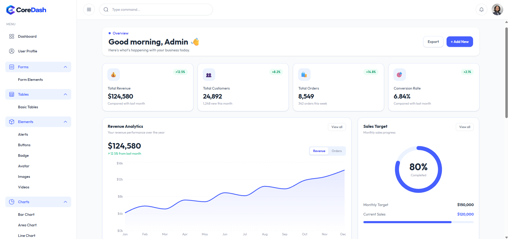
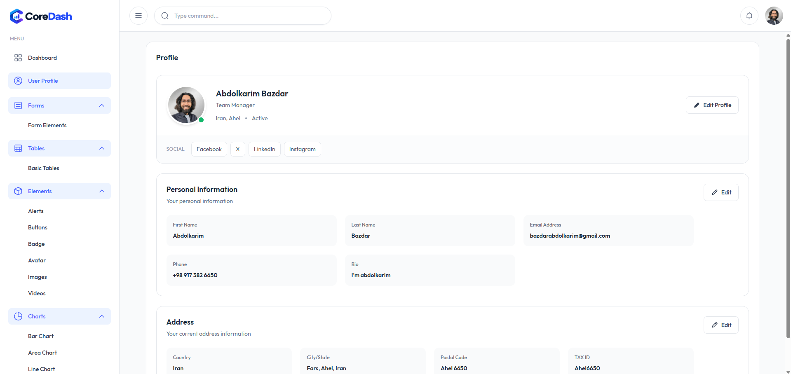
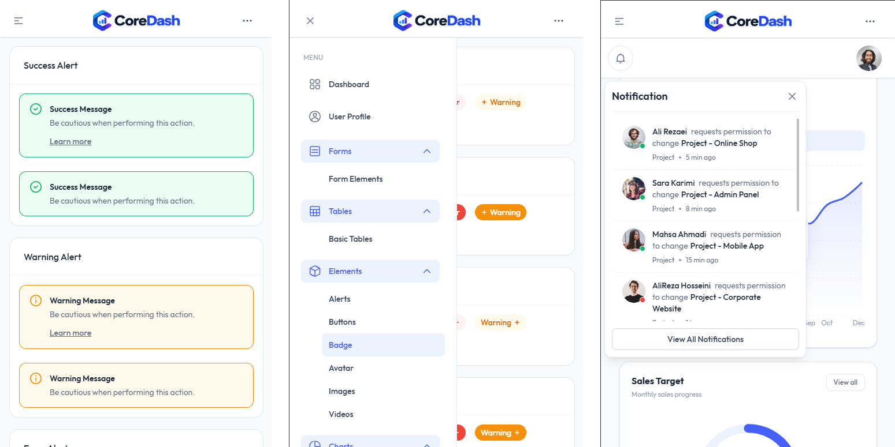

# ْReact Admin Dashboard

> A modern, responsive admin dashboard built with React, TypeScript, Vite, and Tailwind CSS.

<p align="center">
  
  
  
</p>
 
---

## 📌 Overview

**React Admin Dashboard** is a modern and fully responsive admin panel built with the latest React ecosystem.

The project focuses on creating a clean, scalable, and reusable dashboard architecture with responsive layouts, reusable UI components, data visualization, interactive forms, tables, navigation, and modern UI animations.

The project was developed as a portfolio project to demonstrate practical experience with modern frontend development, React architecture, TypeScript, responsive design, and component-based UI development.

---

## ✨ Features

- 📊 Modern Admin Dashboard
- 📱 Fully Responsive Design 
- 🧩 Reusable React Components
- 🗂️ Responsive Sidebar Navigation
- 📋 Data Tables
- 📈 Interactive Charts
- 👤 User Management
- 👤 User Profile
- 📝 Forms and Form Components 
- 📤 Drag & Drop File Upload
- 🎨 Modern UI with Tailwind CSS
- ✨ Smooth UI Animations
- 🧭 Client-side Routing
- 🎯 SVG support as React components
- 🧱 Scalable project structure
- 🔐 Authentication-ready architecture

---

## 🛠️ Tech Stack

### Core

| Technology   | Version |
| ------------ | ------- |
| React        | 19      |
| TypeScript   | 6       |
| Vite         | 8       |
| Tailwind CSS | 4       |
| React Router | 7       |

### UI & Interaction

- **Tailwind CSS** — Utility-first styling
- **shadcn** — Modern reusable UI components
- **Framer Motion** — Animations and transitions
- **React Dropzone** — Drag & drop file uploads
- **React Flatpickr** — Date picker

### Data Visualization

- **Recharts** — Responsive and interactive charts

### Development Tools

- **ESLint** — Code quality and linting
- **TypeScript ESLint** — TypeScript-aware linting
- **Vite Plugin React** — React integration with Vite
- **Vite Plugin SVGR** — Import SVG files as React components

---

## 🧱 Project Structure

```text
 React Admin Panel
├─ index.html
├─ package-lock.json
├─ package.json
├─ public
│  ├─ fonts
│  ├─ images
│  │  ├─ Project
│  │  ├─ shape
│  │  └─ user
│  └─ videos
├─ README.md
├─ src
│  ├─ App.tsx
│  ├─ assets
│  │  ├─ icons
│  │  └─ images
│  ├─ components
│  │  ├─ auth
│  │  ├─ Charts
│  │  ├─ common
│  │  ├─ form
│  │  │  ├─ date-picker.tsx
│  │  │  ├─ form-elements
│  │  │  ├─ Form.tsx
│  │  │  ├─ group-input
│  │  │  ├─ input
│  │  │  ├─ Label.tsx
│  │  │  ├─ MultiSelect.tsx
│  │  │  ├─ Select.tsx
│  │  │  └─ switch
│  │  ├─ Header
│  │  ├─ Table
│  │  ├─ ui
│  │  │  ├─ alert
│  │  │  ├─ avatar
│  │  │  ├─ badge
│  │  │  ├─ button
│  │  │  ├─ dropdown
│  │  │  ├─ images
│  │  │  ├─ modal
│  │  │  ├─ table
│  │  │  └─ videos
│  │  └─ UserProfile
│  ├─ contexts
│  │  ├─ SidebarContext.tsx
│  │  └─ ThemeContext.tsx
│  ├─ hooks
│  │  └─ useModal.ts
│  ├─ main.tsx
│  ├─ pages
│  │  └─ Dashboard
│  │     ├─ layout
│  │     │  ├─ DashboardLayout.tsx
│  │     │  ├─ header
│  │     │  │  ├─ DesktopHeader.tsx
│  │     │  │  ├─ MainHeader.tsx
│  │     │  │  └─ MobileHeader.tsx
│  │     │  └─ menu
│  │     │     ├─ components
│  │     │     │  └─ MenuData.tsx
│  │     │     ├─ DesktopMenu.tsx
│  │     │     ├─ MainMenu.tsx
│  │     │     └─ MobileMenu.tsx
│  │     └─ pages
│  │        ├─ Auth
│  │        │  ├─ AuthPageLayout.tsx
│  │        │  ├─ SignIn.tsx
│  │        │  └─ SignUp.tsx
│  │        ├─ Charts
│  │        │  ├─ AreaChart.tsx
│  │        │  ├─ BarChart.tsx
│  │        │  └─ LineChart.tsx
│  │        ├─ Elements
│  │        │  ├─ Alerts.tsx
│  │        │  ├─ Avatars.tsx
│  │        │  ├─ Badges.tsx
│  │        │  ├─ Buttons.tsx
│  │        │  ├─ Images.tsx
│  │        │  └─ Videos.tsx
│  │        ├─ Forms
│  │        │  └─ index.tsx
│  │        ├─ Home
│  │        │  └─ index.tsx
│  │        ├─ Tables
│  │        │  └─ UsersTable.tsx
│  │        └─ UserProfile
│  │           └─ index.tsx
└─ vite.config.ts
```

The project follows a component-based architecture to keep UI elements reusable, maintainable, and easy to extend.

---

## 📱 Responsive Design

The dashboard is designed to work across different screen sizes:

- 🖥️ Desktop
- 💻 Laptop
- 📱 Mobile
- 📟 Tablet

The layout adapts dynamically to smaller screens while maintaining usability and accessibility.

---

## 📊 Dashboard & Data Visualization

The dashboard includes interactive data visualization using **Recharts**.

Charts are designed to be responsive and integrate naturally with the dashboard layout.

Example use cases include:

- Statistics
- Analytics
- Performance data
- User activity
- Business metrics

---

## 🎨 UI & Design

The interface is built with **Tailwind CSS 4** and reusable React components.

The design system focuses on:

- Consistent spacing
- Reusable components
- Responsive layouts
- Clean typography
- Theme support
- Interactive states
- Modern dashboard patterns

---

## ⚡ Animations

**Framer Motion** is used to provide smooth UI interactions and transitions.

Animations are intentionally kept subtle to improve the user experience without distracting from the dashboard content.

---

## 🚀 Getting Started

### Prerequisites

Make sure you have the following installed:

- Node.js
- npm

### Installation

Clone the repository:

```bash
git clone https://github.com/abdolkarim-dev/React-AdminPanel
```

Navigate to the project:

```bash
cd React-AdminPanel
```

Install dependencies:

```bash
npm install
```

Start the development server:

```bash
npm run dev
``` 
---

## 🧠 Technical Highlights

This project demonstrates practical experience with:

- React 19 and modern React development
- TypeScript for type-safe application development
- Component-based architecture
- Reusable UI components
- Responsive dashboard layouts
- Client-side routing with React Router
- Modern CSS architecture with Tailwind CSS 4
- Data visualization with Recharts
- UI animations with Framer Motion
- Drag-and-drop interactions
- Date and form components
- SVG integration
- ESLint-based code quality
- Scalable frontend project organization

---


## 👨‍💻 Author

**Abdolkarim Bazdar**

Full-Stack Web Developer focused on building modern web applications with React, TypeScript, Laravel, and WordPress.

- GitHub: [@abdolkarim-dev](https://github.com/abdolkarim-dev)
- LinkedIn: [Abdolkarim Bazdar](https://www.linkedin.com/in/abdolkarim-bazdar-2b2ba6107/)

---

## 📄 License

This project is created for educational and portfolio purposes.

 